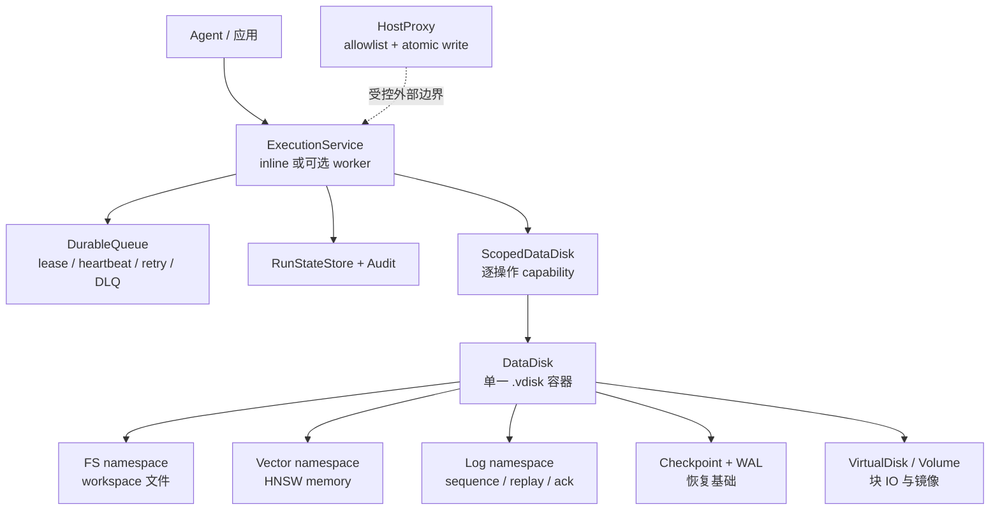
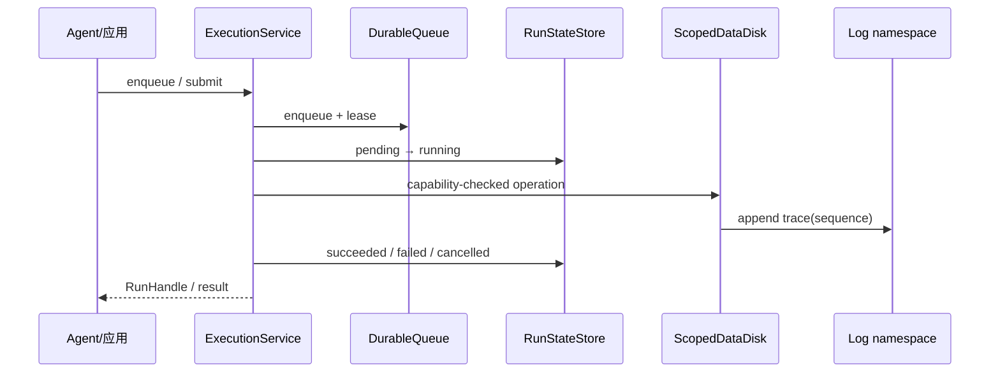
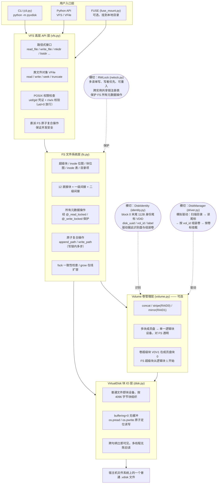
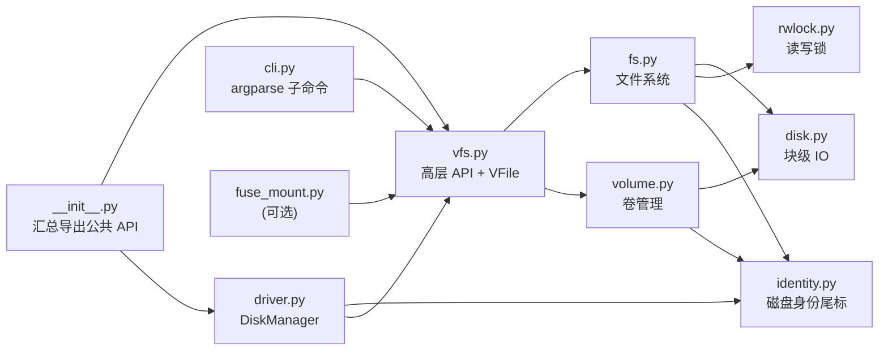
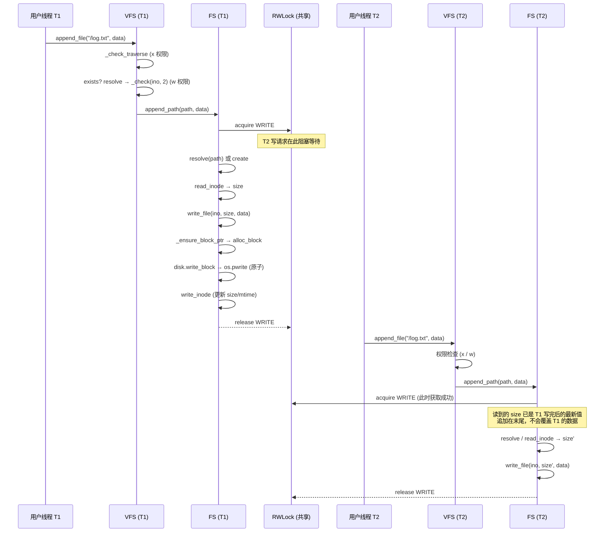
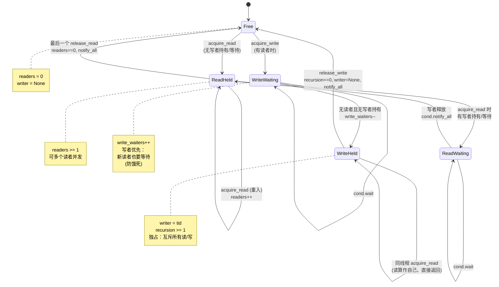
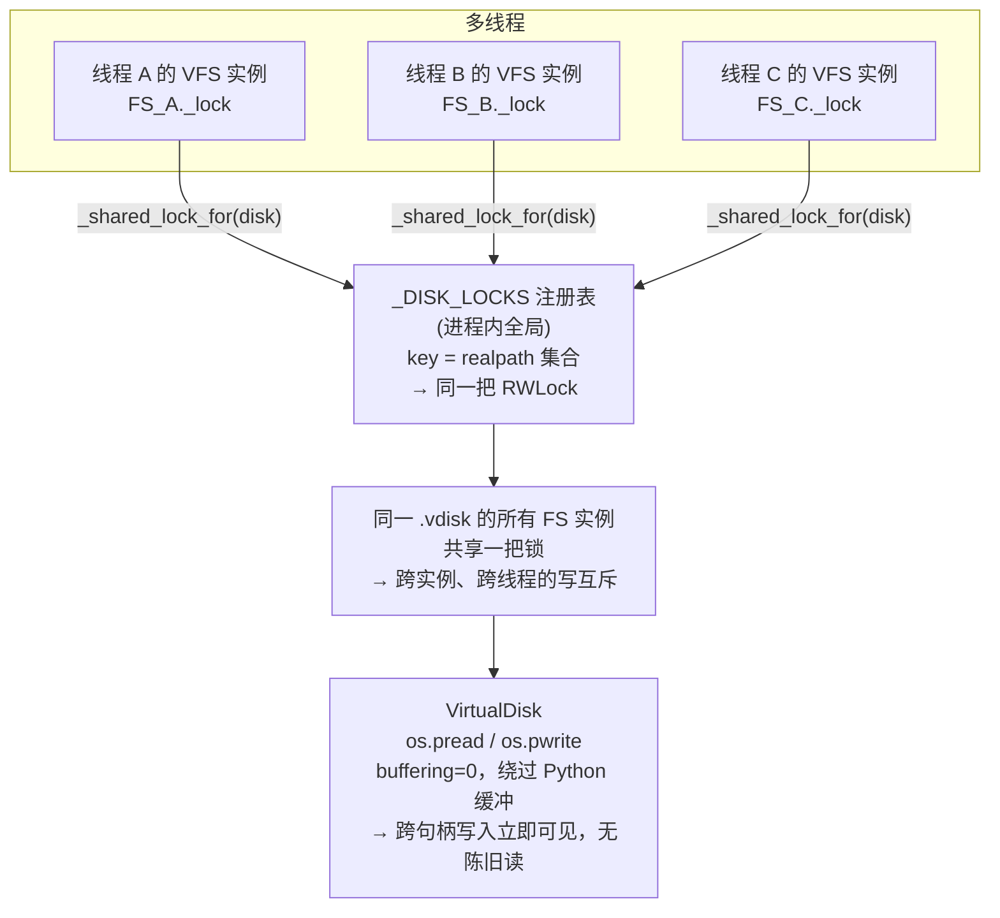
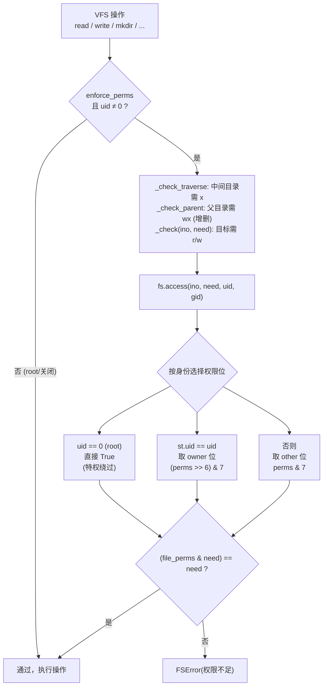
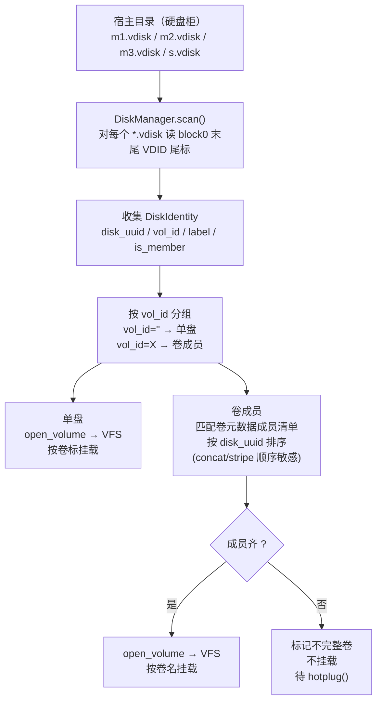

# vdisk

> 批处理语言规范见 [`docs/VSCRIPT_SPEC.md`](docs/VSCRIPT_SPEC.md)。VScript 提供安全 Lexer/Parser/解释器、资源预算、能力受限的文件/向量/日志标准库、Python API，以及 `pyvdisk vscript check|run|repl`。事务、审计、Host allowlist、Cron/checkpoint/文件与日志触发器均提供基础能力；`parallel/task/await` 的 VScript 语义仍是确定性顺序执行。

快速体验：

```vscript
language "1.0";
let total = 0;
for i in 1..=5 { total += i; }
print(total);
```

```bash
pyvdisk vscript check workflow.vds
pyvdisk vscript run workflow.vds --arg docs=data.vdisk \
  --mount data.vdisk:read,write
pyvdisk vscript run-disk tools.vdisk:/.vscript/scripts/job.vds
```

脚本可通过 `import std.fs|vector|log as ...` 导入标准库，以 `require` 声明所需权限，并使用 `mount fs|vector|log NAME from arg("...")` 挂载。运行时只授予脚本声明与 CLI `--mount DISK:PERMISSIONS` 授权的交集。`run-disk` 使用只读引导挂载读取盘内脚本，脚本不能借此提升自身权限。

面向 Agentic 工作流的数据与执行基础设施：以统一 DataDisk 承载工作区、语义记忆、事件轨迹、Checkpoint 和恢复日志；底层采用纯 Python 虚拟磁盘与文件系统，无需管理员权限。

Agentic 项目统一使用 `DataDisk`、明确的 namespace adapter（`disk.fs`、`disk.vector`、`disk.log`）和 `ExecutionService`。新代码不应依赖底层磁盘结构或历史入口。`ExecutionService` 同时支持调用方 inline 执行和可选后台 worker；VScript `parallel/task/await` 仍是确定性顺序执行。`RunStateStore` 和 `DurableQueue` 提供单实例持久化状态、租约、心跳、幂等、重试与 dead-letter 基础。队列任务的 operation/context 注册表不跨进程恢复，因此项目应显式注册可恢复的操作入口，并把外部副作用设计为幂等。`ScopedDataDisk` 是 Agent 默认应使用的逐操作 capability 和 namespace scope 视图；普通 `DataDisk` 仅用于受信任的应用管理代码。

当前适合单机或单实例项目先行使用，并在真实负载下持续增强；不把当前实现当作分布式调度、完整 ACID、exactly-once 或完整 HA 存储。

当前状态可用只读命令查看：`pyvdisk status DATA.vdisk` 输出 DataDisk manifest、namespace 与持久化 run 状态计数；它不启动 worker、不恢复任务，也不执行写操作。该命令仅适用于 `DataDisk` 容器，不是普通 VFS 镜像的替代 `info` 命令。

把一个普通文件当成块设备，在上面实现了一个完整的 inode + 位图文件系统，
并提供路径式 API、类文件对象、命令行工具，以及可选的 FUSE 挂载。
内置**多线程安全**（可重入读写锁）、**POSIX 风格文件权限**与**多盘卷管理**。

> 本文档中的图表使用 [Mermaid](https://mermaid.js.org/) 语法（原生 Markdown 代码块），
> GitHub / GitLab / VS Code 等主流 Markdown 渲染器均原生支持。

## 当前推荐架构

PyVDisk 面向单机或单实例 Agentic 项目，推荐从统一 `.vdisk` 容器开始：



### 一次任务的数据流



### 当前使用边界

- 适合单机或单实例项目，支持边做项目边增强。
- `DataDisk`、显式 namespace、`ExecutionService` 是新代码的推荐入口。
- worker、租约、重试、审计和 WAL 是基础能力，不等于分布式调度、完整 ACID 或 exactly-once。
- `ScopedDataDisk` 才是 Agent 的权限边界；普通 `DataDisk` 仅供受信任的管理代码使用。
- VScript 的 `parallel/task/await` 当前是确定性顺序执行。
- 状态检查使用 `pyvdisk status DATA.vdisk`。

## 特性

- 无需 root，无需任何系统权限——只是普通文件的读写
- 自包含文件系统：超级块、inode 位图、块位图、inode 表、数据块
- 支持大文件：12 直接块 + 一级间接 + 二级间接（理论上限约 4 GB / 文件）
- **多线程安全**：
  - 可重入读写锁（`RWLock`）：多读单写、写者优先、同线程可重入，防饿死
  - 跨实例共享锁注册表：同一镜像被多个 `VFS`/`FS` 实例打开时共享同一把锁
  - 无缓冲原子 IO（`os.pread`/`os.pwrite`）：跨句柄立即可见，杜绝陈旧读
  - 复合操作原子化（`fs.append_path`/`fs.write_path`）：避免 stat→write 的 TOCTOU 竞态
- **POSIX 风格文件权限**：
  - `uid`/`gid` 凭证模拟，`uid=0`（root）特权绕过
  - owner/group/other 三级权限位检查（r=4 / w=2 / x=1）
  - 路径遍历(x)、读(r)、写(w)、父目录(wx) 全套检查；`chmod/chown/utime` 属主/root 约束
- 完整的文件系统语义：
  - 目录、嵌套目录、符号链接（含路径解析跟踪与循环检测）、硬链接
  - `chmod / chown / utime / access` 属性与权限管理
  - 稀疏文件（截断扩大后空洞读零，按需分配块）
  - 重命名、截断、递归删除
- 一致性检查 `fsck`：检测孤儿块、nlink 不一致、无效引用，支持自动修复
- 在线扩容 `grow`：不破坏数据扩大磁盘容量
- **多盘融合（卷管理）**：原生支持三种 RAID 模式
  - `concat` 级联：多盘拼接，容量叠加
  - `stripe` 条带（RAID0）：数据跨盘条带化，并行度高
  - `mirror` 镜像（RAID1）：多盘互为副本，提供冗余，支持在线增删盘与重同步
  - **自动检测**：所有文件系统命令（`ls/mkdir/write/cat/...`）传入任意一块成员盘即可自动识别并打开整个卷
- **卷标 + 模拟驱动**：每块盘带统一识别码（disk_uuid / 卷标），**不再以路径为索引**
  - `DiskManager` 把一个宿主目录当"硬盘柜"：扫描 `*.vdisk` → 读身份尾标 → 按 `vol_id` 组装卷 → 按卷标挂载
  - 热插拔：把 img 文件复制进目录就能被识别并挂载，盘文件移动/改名不影响识别
- 空间统计：`statfs / df / du`
- 高层 API：`read_file / write_file / listdir / makedirs / rmtree / walk ...`
- 类文件对象 `VFile`：`read / write / seek / truncate / flush`
- 宿主机 ⇄ 虚拟磁盘 互导文件 / 目录树
- 命令行工具 `vdisk`（`python -m pyvdisk`）
- 可选 FUSE 挂载（`pip install fusepy`），把镜像挂到本地目录当真实文件系统用

## 架构图

整体分五层，自上而下逐层下沉；`RWLock`（并发）与 `DiskIdentity`（身份）作为横切关注点贯穿各层。



## 模块依赖图（程序图）

箭头表示「依赖于」。`rwlock` 与 `identity` 是被多方依赖的基础设施，依赖关系无环。



`__init__.py` 汇总导出：`VFS, VFile, FS, VirtualDisk, Volume, RWLock, DiskManager, mkfs, grow, ...` 全部公共 API。

## 请求流转图

一次 `vfs.append_file("/log.txt", data)` 在多线程下的完整流转（含锁与权限）：



要点：

- **权限检查在 VFS 层**，发生在加锁之前（check-then-act，uid=0 直接放行）
- **数据原子性在 FS 层**：`append_path` 在一把写锁内完成「解析/创建 + 读 size + 写入」
- 若无原子化，T1 读到 size=0、T2 也读到 size=0，二者都写在 offset 0 → 丢更新（旧 bug）

## 读写锁状态图

`RWLock` 状态机：多读并发、写独占、写者优先、同线程可重入。



## 并发安全模型



为什么需要共享锁注册表：多线程里每个线程各自 `VFS(img)` 会得到不同的 `FS` 实例，
若各自持有独立锁则无法互斥。注册表按磁盘身份（realpath 集合）复用同一把 `RWLock`，
保证「同一虚拟磁盘，全局一把锁」。

## 权限检查流转图

VFS 持有 `uid`/`gid`/`enforce_perms` 三项凭证，每个路径操作前按 POSIX 语义检查。



特殊约束：

- `chmod` / `utime` —— 需文件属主或 root
- `chown` —— 仅 root（uid=0）

## 多盘卷组装流程图

`DiskManager` 扫描目录，按身份尾标组装卷并挂载。



## 磁盘布局

| 块范围 | 内容 | 说明 |
|--------|------|------|
| 块 0 | 超级块 (magic `VDK1`) | magic / version / block_size / total_blocks / total_inodes ...；**末尾 112 字节为磁盘身份尾标 (magic `VDID`)** |
| 块 `inode_bitmap_*` | inode 位图 | 每位对应一个 inode |
| 块 `block_bitmap_*` | 数据块位图 | 每位对应一个数据块 |
| 块 `inode_table_*` | inode 表 | 每 inode 128 字节 |
| 块 `data_start..` | 数据块 | 每块 4096 字节 |

**inode 结构**（128 字节，打包 101 字节后补齐）：

| 字段 | 字节数 | 说明 |
|------|--------|------|
| type | 1 | 文件类型（FILE/DIR/SYMLINK） |
| mode | 2 | 权限位 |
| nlink | 2 | 硬链接数 |
| uid / gid | 4 / 4 | 属主 / 属组 |
| size | 8 | 文件大小 |
| atime / mtime / ctime | 8 / 8 / 8 | 访问 / 修改 / 状态变更时间 |
| direct[12] | 48 | 直接块指针 |
| single / double | 4 / 4 | 一级 / 二级间接块指针 |

**目录项**（定长 32 字节）：`inode(4) + type(1) + name(27)`

**身份尾标 `VDID`**（block 0 末尾 112 字节）：`disk_uuid(36) + vol_id(36) + label(32)`，写超级块时用读-改-写保留。

多盘卷的成员盘：块 0 是卷超级块（magic `VDV1`），同样在末尾带 `VDID` 身份尾标；
文件系统超级块从逻辑块 1 开始（块 0 预留给卷元数据 + 身份尾标）。

其他要点：

- inode 0 保留（类似 ext2），根目录使用 inode 1
- inode 包含 12 个直接块指针、1 个一级间接指针、1 个二级间接指针
- 稀疏文件：截断扩大后不预分配块，读取空洞返回零

## 安装

```bash
pip install -e .
# 可选：FUSE 挂载支持
pip install fusepy
```


## 向量数据盘

向量数据盘是特殊的 **.vdisk** 容器：底层仍由 PyVDisk 文件系统持久化，但其上层语义是多个命名向量集合。每个集合分别配置维度、距离度量（cosine / l2 / ip）和 HNSW 参数，并把向量记录、JSON 元数据及 hnswlib 索引全部存入同一块盘。

> hnswlib 是项目的上游必需依赖。它通过临时文件完成 save_index/load_index，但最终索引保存在向量数据盘内部。

```python
from pyvdisk import VectorDisk

VectorDisk.create("embeddings.vdisk", 64 * 1024 * 1024, label="knowledge")
with VectorDisk("embeddings.vdisk") as disk:
    disk.create_collection("docs", dimension=3, metric="cosine")
    disk.upsert("docs", "doc-1", [1, 0, 0], {"kind": "news", "score": 0.9})
    disk.upsert("docs", "doc-2", [0, 1, 0], {"kind": "blog", "score": 0.5})
    hits = disk.search("docs", [1, 0, 0], k=5,
                       where={"score": {"$gte": 0.8}})
```

元数据过滤支持直接等值以及 `$eq/$ne/$gt/$gte/$lt/$lte/$in`，顶层支持 `$and/$or`。CLI 提供 `vec-create / vec-collection / vec-upsert / vec-search / vec-get / vec-delete / vec-list`。

## 日志数据盘与统一日志组件

日志数据盘借鉴时序数据库的分段与索引思想：一块特殊 **.vdisk** 包含多个命名日志流，事件按纳秒时间戳追加到 NDJSON 分段；manifest 保存每段的时间范围、级别、logger 和标签索引，用于查询时整段裁剪。支持时间范围、级别、logger、标签和字段过滤，以及 tail/follow、保留策略、压缩和统计。

```python
from pyvdisk import LogDisk, LogDiskSink, get_logger, log_context

LogDisk.create("service-logs.vdisk", 64 * 1024 * 1024, label="observability")
with LogDisk("service-logs.vdisk") as disk:
    disk.create_stream("app", segment_events=1000,
                       retention_seconds=7 * 86400, max_events=100000)
    logger = get_logger("api", LogDiskSink(disk, "app"), service="gateway")
    with log_context(trace_id="trace-1", request_id="req-1"):
        logger.info("request complete", fields={"latency_ms": 12.5},
                    tags={"env": "prod"})
    errors = disk.query("app", levels=["ERROR"], tags={"env": "prod"})
```

统一日志组件包括 `LogEvent`、`UnifiedLogger`、`MemorySink`、`StreamSink`、`LogDiskSink`、基于 `contextvars` 的上下文传播，以及把标准库 `logging` 转成结构化事件的 `StandardLoggingHandler`。CLI 提供 `log-create / log-stream / log-emit / log-query / log-tail / log-stats / log-compact / log-retention`。

## 快速上手（Python API）

```python
from pyvdisk import VFS

# 创建一个 16MB 的虚拟磁盘
VFS.create("disk.vdisk", 16 * 1024 * 1024)

with VFS("disk.vdisk") as vfs:
    vfs.makedirs("/docs/notes")
    vfs.write_file("/docs/notes/today.txt", b"hello vdisk")
    print(vfs.read_file("/docs/notes/today.txt"))

    # 类文件对象
    with vfs.open("/data.bin", "wb") as f:
        f.write(b"abcd" * 1000)
    with vfs.open("/data.bin", "rb") as f:
        f.seek(100)
        print(f.read(10))
```

## 多线程并发

同一镜像可被多个线程（乃至多个 `VFS` 实例）并发访问，读写锁保证一致性。

```python
import threading
from pyvdisk import VFS

VFS.create("disk.vdisk", 16 * 1024 * 1024)

def worker(n):
    with VFS("disk.vdisk") as vfs:
        for _ in range(n):
            # 原子追加：写锁内完成 读size + 写入，多线程不丢更新
            vfs.append_file("/log.txt", b"line\n")

ts = [threading.Thread(target=worker, args=(20,)) for _ in range(10)]
for t in ts: t.start()
for t in ts: t.join()

with VFS("disk.vdisk") as vfs:
    assert vfs.read_file("/log.txt").count(b"line\n") == 200  # 10 × 20
```

## 文件权限

VFS 持有 `uid`/`gid` 凭证，默认 `uid=0`（root，放行所有操作）。
设置非 0 的 `uid` 即启用 POSIX 风格权限隔离：

```python
from pyvdisk import VFS, FSError

with VFS("disk.vdisk") as vfs:
    vfs.write_file("/secret.txt", b"top secret")
    vfs.chown("/secret.txt", uid=1000, gid=1000)
    vfs.chmod("/secret.txt", 0o644)   # rw-r--r--：其他人只读

    # 切换身份为 uid=2000 的其他用户
    vfs.uid, vfs.gid = 2000, 2000
    print(vfs.read_file("/secret.txt"))   # OK：other 有 r
    try:
        vfs.write_file("/secret.txt", b"hacked")  # 失败：other 无 w
    except FSError as e:
        print("拒绝写入:", e)

    # 关闭权限检查（等同 root）
    vfs.enforce_perms = False
    vfs.write_file("/secret.txt", b"ok")  # OK
```

## 命令行

```bash
python -m pyvdisk create disk.vdisk --size 16M
python -m pyvdisk mkdir disk.vdisk /docs
echo "hi" | python -m pyvdisk write disk.vdisk /docs/hello.txt
python -m pyvdisk cat disk.vdisk /docs/hello.txt
python -m pyvdisk ls disk.vdisk / -l
python -m pyvdisk tree disk.vdisk /

# 以指定 uid/gid 身份操作（启用权限检查；选项须放在子命令之后）
python -m pyvdisk cat disk.vdisk /docs/hello.txt --uid 1000 --gid 1000
python -m pyvdisk cat disk.vdisk /docs/hello.txt --no-perm   # 关闭权限检查

# 链接
python -m pyvdisk ln disk.vdisk /docs/hello.txt /docs/hard.txt        # 硬链接
python -m pyvdisk ln disk.vdisk -s /docs/hello.txt /docs/soft.txt     # 符号链接

# 属性
python -m pyvdisk chmod disk.vdisk 644 /docs/hello.txt
python -m pyvdisk chown disk.vdisk /docs/hello.txt --owner 1000
python -m pyvdisk stat disk.vdisk /docs/hello.txt

# 空间与一致性
python -m pyvdisk df disk.vdisk
python -m pyvdisk du disk.vdisk /
python -m pyvdisk fsck disk.vdisk              # 检查
python -m pyvdisk fsck disk.vdisk --repair     # 检查并修复

# 扩容（在线，不破坏数据）
python -m pyvdisk resize disk.vdisk --size 64M

# 导入导出
python -m pyvdisk import disk.vdisk ./photo.jpg /photo.jpg
python -m pyvdisk export disk.vdisk /photo.jpg ./out.jpg

# 可选：FUSE 挂载（无需 root，需 fusepy + 系统支持）
mkdir /tmp/vdisk
python -m pyvdisk mount disk.vdisk /tmp/vdisk
```

## 多盘融合（卷管理 / RAID）

把多块虚拟磁盘镜像组合成一个逻辑卷，文件系统跑在卷上，无需改一行 FS 代码。

```bash
# 创建卷（concat/stripe/mirror），--disk-size 在盘不存在时自动创建
python -m pyvdisk vol-create concat d1.vdisk d2.vdisk --name myvol --disk-size 4M
python -m pyvdisk vol-create stripe s1.vdisk s2.vdisk --disk-size 4M
python -m pyvdisk vol-create mirror m1.vdisk m2.vdisk --disk-size 4M

# 查看卷状态
python -m pyvdisk vol-status d1.vdisk d2.vdisk

# 在卷上格式化文件系统
python -m pyvdisk vol-format d1.vdisk d2.vdisk

# 之后所有普通命令都能直接用——只需传任意一块成员盘：
python -m pyvdisk mkdir d1.vdisk /docs          # 自动识别为卷
python -m pyvdisk write d1.vdisk /docs/a.txt <<< "hi"
python -m pyvdisk cat d2.vdisk /docs/a.txt      # 换一块成员盘也能读
python -m pyvdisk df d1.vdisk
python -m pyvdisk fsck d1.vdisk

# 镜像卷维护：在线增删盘 + 重同步
python -m pyvdisk vol-add m1.vdisk m2.vdisk m3.vdisk --disk-size 4M
python -m pyvdisk vol-resync m1.vdisk m2.vdisk m3.vdisk
python -m pyvdisk vol-remove m1.vdisk m2.vdisk m3.vdisk m3.vdisk
```

Python API：

```python
from pyvdisk import VFS, create_volume, open_volume

# 创建卷并格式化
VFS.create_volume(["d1.vdisk", "d2.vdisk"], "stripe", disk_size=4*1024*1024)

# 直接用 VFS（自动检测卷）
with VFS("d1.vdisk") as vfs:        # 传任意一块成员盘即可
    vfs.write_file("/x.bin", b"striped" * 1000)
    print(vfs.read_file("/x.bin")[:20])

# 或显式打开卷
vol = open_volume(["d1.vdisk", "d2.vdisk"])
print(vol.status())               # {'mode': 'stripe', 'ndisks': 2, ...}
vol.close()
```

卷布局：每块成员盘的第 0 块保存卷超级块（魔数 `VDV1`，含卷 ID / 模式 / 成员清单 / 几何），
文件系统超级块从逻辑块 1 开始。三种模式的数据分布：

| 模式 | 容量 | 数据分布 | 特点 |
|------|------|----------|------|
| concat | 各盘之和 | 顺序拼接 | 容量最大 |
| stripe (RAID0) | min(盘) × N | 跨盘条带轮转 | 并行读写 |
| mirror (RAID1) | min(盘) | 全盘复制 | 冗余容错 |

## 卷标 + 模拟驱动

每块盘（单盘或卷成员盘）在 block 0 末尾带一个 **身份尾标**（魔数 `VDID`，112 字节），
含该盘自己的 `disk_uuid`、所属 `vol_id` 和卷标。**不再用文件路径作为索引**——
盘文件被复制 / 移动后，身份不变，仍能被识别。

`DiskManager` 是模拟驱动：把一个宿主目录当"硬盘柜"，扫描其中的 `*.vdisk`，
按 `vol_id` 把成员盘组装成完整卷，再按卷标挂载。

```bash
# 创建带卷标的单盘
python -m pyvdisk create single.vdisk --size 4M --label docs

# 创建带卷名的多盘卷
python -m pyvdisk vol-create mirror m1.vdisk m2.vdisk --name safedata --disk-size 4M
python -m pyvdisk vol-format m1.vdisk m2.vdisk

# 扫描目录，识别其中的盘与卷
python -m pyvdisk scan /path/to/bay

# 扫描并挂载所有可识别的盘/卷，按卷标列出
python -m pyvdisk mount-all /path/to/bay

# 查看 / 设置单盘卷标
python -m pyvdisk label single.vdisk          # 查询
python -m pyvdisk label single.vdisk mydocs   # 设置
```

Python API：

```python
from pyvdisk import DiskManager

mgr = DiskManager("/path/to/bay")
mgr.scan()              # 识别所有盘
mgr.mount_all()         # 挂载所有单盘 + 完整卷，按卷标注册

# 按卷标访问（不再关心文件路径）
mgr.get("docs").vfs.write_file("/a.txt", b"hi")
print(mgr.get("safedata").vfs.read_file("/b.txt"))

print(mgr.labels())     # ['docs', 'safedata']

# 热插拔：往目录里复制一块新盘，再调用 hotplug() 即可识别并挂载
import shutil
shutil.copy("/elsewhere/newdisk.vdisk", "/path/to/bay/")
new = mgr.hotplug()
print([m.label for m in new])

mgr.unmount_all()
```

工作流要点：

- 单盘用 `label` 字段做卷标；多盘卷用卷名（`vol-create --name`）做卷标
- 卷成员盘的 `disk_uuid` 与卷元数据中的成员清单匹配，驱动据此组装并按成员顺序排列（concat/stripe 顺序敏感）
- 成员盘未到齐的卷显示为"不完整卷"，不会被挂载；补齐后再 `hotplug()` 即可

## 局限

- 进程内多线程安全（共享锁注册表为进程级全局）；跨进程并发需借助文件锁
- 权限检查为 check-then-act 语义（与 POSIX 一致），不保证 TOCTOU 极端竞态下的强一致
- 文件名编码后不超过 27 字节
- FUSE 挂载需要系统已安装 fuse 并允许当前用户使用（Linux）或 macFUSE（macOS）

## 许可证

MIT
