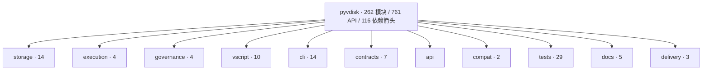

<div align="center">

# PyVDisk

**单机 Agentic 数据与执行基础设施**

[](https://github.com/HeDaas-Code/pyvdisk)
[](https://www.python.org/)
[](#验证)

PyVDisk 是一个包含 VScript 脚本运行时的单机 Agentic 数据与执行基础设施项目：DataDisk 负责统一数据与执行基础设施，VScript 负责安全工作流语言、CLI、REPL 与运行时。

</div>

> 面向单机、单实例 Agentic 项目：一个 `.vdisk` 容器统一承载 workspace、semantic memory、event trace、Checkpoint、WAL、Metadata 和运行状态。

## 架构总览

<div align="center"><table><tr><th colspan="3">Agent / 应用</th></tr><tr><td colspan="3">VScript · Python API · CLI · REPL · HostProxy</td></tr><tr><th>Execution</th><th>Capability</th><th>Storage</th></tr><tr><td>ExecutionService<br>DurableQueue<br>worker · lease · retry · DLQ<br>RunState · Audit</td><td>ScopedDataDisk<br>FS / Vector / Log / Checkpoint<br>逐操作权限</td><td>DataDisk<br>单一 .vdisk<br>WAL · transaction · recovery</td></tr><tr><th>FS</th><th>Vector</th><th>Log</th></tr><tr><td>workspace</td><td>HNSW memory<br>generation · checksum</td><td>trace<br>sequence · replay · ack</td></tr><tr><th colspan="3">VirtualDisk · Volume · lock · fsync · mirror degraded fallback</th></tr></table></div>

## 架构图谱

**▶ [打开可交互架构图谱](https://htmlpreview.github.io/?https://github.com/HeDaas-Code/pyvdisk/blob/master/normify-pyvdisk/normify.html)** — 点击模块逐层下钻、悬停查看中英双语介绍、`?lang=en` 切换英文、`#module=<id>` 深链直达具体模块。

> GitHub 会过滤 README 中的 `<script>` / `<iframe>`，自包含的交互页无法内联渲染，因此上传的是**一键运行**链接：由 htmlpreview 直接执行仓库内 `normify-pyvdisk/normify.html`（单文件、无外部依赖、无网络请求）。下面的 Mermaid 图则在 GitHub 上原生渲染。



存储与执行平面展开：

```mermaid
graph TD
  S["pyvdisk.storage"] --> S_datadisk["datadisk · 7（事务容器）"]
  S --> S_fs["fs · 23（inode/目录/块分配）"]
  S --> S_vfs["vfs · 16（路径式门面）"]
  S --> S_volume["volume · 8（卷与镜像冗余）"]
  S --> S_log["log · 6"]
  S --> S_driver["driver · 5"]
  S --> S_logging["logging · 5"]
  S --> S_vector["vector · 4"]
  S --> S_identity["identity · 4"]
  S --> S_fuse["fuse · 4"]
  S --> S_block["block · 3"]
  S --> S_checkpoint["checkpoint · 3"]
  S --> S_wal["wal · 3"]
  S --> S_rwlock["rwlock · 2"]
  E["pyvdisk.execution"] --> E_operations["operations · 6"]
  E --> E_queue["queue · 5"]
  E --> E_service["service · 4"]
  E --> E_runstate["runstate · 2"]
  G["pyvdisk.governance"] --> G_namespace["namespace（能力门禁）"]
  G --> G_files["files"]
  G --> G_data["data"]
  G --> G_scoped["scoped（ScopedDataDisk）"]
```



| 产物 | 说明 |
|---|---|
| [`normify-pyvdisk/normify.html`](normify-pyvdisk/normify.html) | 单文件可交互图谱（262 模块 / 761 API / 116 依赖箭头） |
| [`normify-pyvdisk/outline.md`](normify-pyvdisk/outline.md) | 缩进式模块大纲，适合逐层通读 |
| [`normify-pyvdisk/api-index.json`](normify-pyvdisk/api-index.json) | 全量 API 索引 |
| [`normify-pyvdisk/tree.json`](normify-pyvdisk/tree.json) | 编译产物：模块、每层布局、依赖边、内容指纹 |
| [`normify-pyvdisk/modules/`](normify-pyvdisk/modules) | 262 个模块 Markdown，frontmatter 为机器可读契约（含源码路径与行号证据） |

图谱由 Normify 从仓库源码生成，每个叶子模块都带**仓库内真实文件路径 + 行号区间**的 `source` 证据与 SHA-256 指纹，冻结于 commit `6d203c0`；`normify_validate` 结果为 0 error。

## 项目定位

单机、单实例 Agentic 数据与执行基础设施。一个 DataDisk 承载 workspace、semantic memory、event trace、Checkpoint、Metadata、WAL 和运行状态。可以直接用于项目，并按真实负载持续增强。

## 快速开始

```bash
python -m pip install -e .
python -m pip install -e ".[dev]"
```

```python
from pyvdisk import DataDisk
with DataDisk.create("agent.vdisk", 32 * 1024 * 1024) as disk:
    disk.fs.write_file("/workspace/hello.txt", b"hello")
    disk.vector.create_collection("memory", 3)
    disk.vector.upsert("memory", "greeting", [1, 0, 0])
    disk.log.create_stream("events")
    disk.log.append("events", level="INFO", logger="demo", message="started")
```

## VScript

VScript 与 PyVDisk 共用 DataDisk、namespace、capability、事务、WAL 和审计模型，支持 Lexer、Parser、解释器、变量、表达式、循环、函数、模块、标准库、事务、rollback、task/await/parallel、cron、触发器、REPL 和盘内脚本。详细规范见 [docs/VSCRIPT_SPEC.md](docs/VSCRIPT_SPEC.md)。

```bash
pyvdisk vscript check workflow.vds
pyvdisk vscript run workflow.vds
pyvdisk vscript repl
pyvdisk vscript run-disk tools.vdisk:/.vscript/scripts/job.vds
```

## 核心能力

- Storage Plane：FS、Vector、Log、Checkpoint、Metadata、WAL、VirtualDisk、Volume。
- Execution Plane：ExecutionService、DurableQueue、worker、lease、heartbeat、retry、idempotency、dead-letter、RunState、Audit。
- 单 DataDisk ACID：统一 txid、intent、prepare、apply、commit、abort 和 recovery。
- 内部 exactly-once：operation_id、结果持久化、任务去重、Log event_id 去重。
- 安全：ScopedDataDisk、路径/collection/stream scope、Host allowlist、atomic write。
- 可靠性：generation、checksum、fsync、mirror degraded fallback、remount recovery。

## 使用边界

不实现分布式调度平台、跨机器 worker 或分布式 broker；不做多租户和旧格式迁移。内部 exactly-once 不覆盖外部邮件、支付、第三方 API 或外部数据库。VScript parallel/task/await 当前为确定性顺序语义。普通 DataDisk 是受信任管理视图，Agent 应使用 ScopedDataDisk。

## CLI

```bash
pyvdisk status agent.vdisk
pyvdisk info image.vdisk
```

`status` 只读显示 DataDisk manifest、namespace 和 RunState 计数。

## 技术文档

| 文档 | 内容 |
|---|---|
| [ARCHITECTURE.md](docs/ARCHITECTURE.md) | 详细设计架构、数据流、恢复和解释器架构 |
| [CONTRACTS.md](docs/CONTRACTS.md) | Storage/Execution/ACID/exactly-once 契约 |
| [API_GOVERNANCE.md](docs/API_GOVERNANCE.md) | API、权限、边界与使用策略 |
| [VSCRIPT_SPEC.md](docs/VSCRIPT_SPEC.md) | VScript 语言、标准库和安全规则 |

## 验证

```bash
.venv/bin/python -m pytest -q
```

当前回归：193 passed
